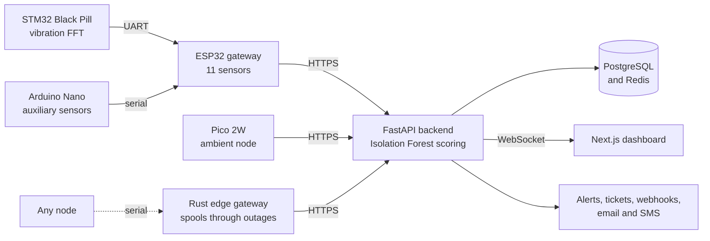

<picture>
  <source media="(prefers-color-scheme: dark)" srcset="https://raw.githubusercontent.com/phaemos/phaemos/main/assets/brand/phaemos-logo-dark.png">
  
</picture>

**Reveal before failure.** An open industrial IoT platform for predictive maintenance.

[Documentation](https://github.com/phaemos/phaemos/tree/main/docs) · [Roadmap](https://github.com/orgs/phaemos/projects/1) · [Discussions](https://github.com/phaemos/phaemos/discussions) · [Contributing](https://github.com/phaemos/phaemos/blob/main/CONTRIBUTING.md)

## Why PHAEMOS

Machines rarely fail without warning. Bearings wear, motors run hot and vibration creeps up for weeks before a breakdown. Condition monitoring catches that drift, but commercial systems are priced for large plants and tied to one vendor's sensors and cloud.

PHAEMOS brings the same idea to any workshop, lab or small site: low-cost microcontroller nodes on the machine, a model that learns what normal looks like for that machine and an open stack you host yourself.

## The name

Machines fail. Not suddenly but gradually, silently and invisibly. PHAEMOS exists to reveal what machines cannot say about themselves.

The name, pronounced FAY-mos, is coined from two Ancient Greek roots:

| Part | Root | Meaning |
| --- | --- | --- |
| PHAE- | *phaen-* (φαιν-), as in *phaínein* | to reveal, to bring to light, the root behind *phenomenon* |
| -MOS | *-mos*, as in *kósmos* (κόσμος) | system or order |

Together they mean "an ordered system that reveals". The platform learns the normal order of each machine and reveals the readings that break it before they become a failure, which is where the tagline comes from: **reveal before failure**.

PHAEMOS has a sister project, [MELOPHOS](https://github.com/melophos), named the same way. Its *phos* (φῶς, light) and the *phaen-* in PHAEMOS go back to the same ancient root, meaning "to shine".

## How it works

Each node streams its readings to the API, which stores them and scores every reading against the machine's normal behaviour. A reading that drifts raises an alert, which can become a maintenance ticket. The full picture is in [docs/architecture.md](https://github.com/phaemos/phaemos/blob/main/docs/architecture.md).

## What it does

- **Four sensor nodes.** An ESP32 gateway with 11 sensors, an STM32 running a vibration FFT at 100 Hz, an Arduino Nano and a Raspberry Pi Pico 2W cover temperature, vibration, current, gas, sound, distance and shaft speed.
- **Anomaly detection without fault data.** An Isolation Forest learns each machine's normal behaviour and scores readings as they arrive, so no labelled failures are needed to start.
- **Operations built in.** Alert rules, maintenance windows, tickets, webhooks to Slack, Discord and Teams, email and SMS, tamper-evident audit logs and role-based access with two-factor sign-in.
- **Resilient at the edge.** A Rust gateway spools every reading to disk during a network outage and sends it on in order once the link returns.
- **Built to be built on.** A Python SDK, a simulator with injectable faults and a Go CLI for load testing.
- **Open hardware and software.** CERN-OHL-S hardware designs, AGPL code and a Docker Compose stack you run yourself.

## Where it stands

> [!NOTE]
> The platform software runs end to end today, with a simulator standing in for real machines. I am now wiring the four physical nodes and preparing to train the model on real readings.

| Milestone | What it covers |
| --- | --- |
| [Verify: full local test](https://github.com/phaemos/phaemos/milestone/1) | The whole stack run locally, every page walked end to end |
| [Community: Discord server](https://github.com/phaemos/phaemos/milestone/2) | A scripted Discord server for support, each board and show and tell |
| [Launch: external services](https://github.com/phaemos/phaemos/milestone/3) | The API, dashboard, docs and status page online, with email, SMS and social sign-in |
| [Hardware: physical nodes](https://github.com/phaemos/phaemos/milestone/4) | Every sensor tested on real machines, the model trained on that data, then PCBs and enclosures |

## Built with

### Languages

|  |  |  |  |  |  |
| :---: | :---: | :---: | :---: | :---: | :---: |
| **Python** | **TypeScript** | **C++** | **Rust** | **Go** | **MicroPython** |

### Backend and data

|  |  |  |  |  |
| :---: | :---: | :---: | :---: | :---: |
| **FastAPI** | **SQLAlchemy** | **scikit-learn** | **PostgreSQL** | **Redis** |

### Dashboard

|  |  |
| :---: | :---: |
| **Next.js** | **Tailwind CSS** |

### Sensor nodes

|  |  |  |  |  |
| :---: | :---: | :---: | :---: | :---: |
| **ESP32** | **STM32** | **CMSIS-DSP** | **Arduino** | **Raspberry Pi** |

### Hardware design

|  |
| :---: |
| **Proteus** |

### Infrastructure

|  |  |  |
| :---: | :---: | :---: |
| **Docker** | **Prometheus** | **Grafana** |

| Layer | Stack |
| --- | --- |
| Sensor nodes | C and C++ on the ESP32, STM32 (CMSIS-DSP) and Arduino Nano, MicroPython on the Pico 2W |
| Edge gateway | Rust |
| Backend | Python, FastAPI, SQLAlchemy and scikit-learn |
| Data | PostgreSQL and Redis |
| Dashboard | TypeScript, Next.js and Tailwind CSS |
| Developer tools | Python SDK and simulator, Go CLI (`phaemosctl`) |
| Hardware | Proteus schematics and PCB layouts |
| Infrastructure | Docker Compose, Prometheus and Grafana |

## Repositories

| Repository | What it is |
| --- | --- |
| [phaemos](https://github.com/phaemos/phaemos) | The monorepo where all development happens. Start here |
| [backend](https://github.com/phaemos/backend) | FastAPI ingest, alerting, tickets and anomaly scoring |
| [frontend](https://github.com/phaemos/frontend) | Next.js live monitoring dashboard |
| [firmware](https://github.com/phaemos/firmware) | Firmware for the ESP32, STM32, Arduino Nano and Pico 2W nodes |
| [hardware](https://github.com/phaemos/hardware) | Wiring tables, schematics, PCB layouts and the parts inventory |
| [edge](https://github.com/phaemos/edge) | Rust store-and-forward gateway |
| [client](https://github.com/phaemos/client) | Python SDK, telemetry simulator and the `phaemosctl` Go tool |
| [infra](https://github.com/phaemos/infra) | Docker Compose stack, monitoring and reporting SQL |

Every component repository is a read-only copy published from the monorepo. Issues, discussions and pull requests all go to [phaemos/phaemos](https://github.com/phaemos/phaemos).

## Get involved

- **Start here:** the [welcome post](https://github.com/phaemos/phaemos/discussions/133) and the [roadmap post](https://github.com/phaemos/phaemos/discussions/284)
- **Try it without hardware:** [run PHAEMOS on a laptop](https://github.com/phaemos/phaemos/discussions/289) with the simulator
- **Questions and ideas:** [Discussions](https://github.com/phaemos/phaemos/discussions), with [Q&A](https://github.com/phaemos/phaemos/discussions/categories/q-a) for help and [Research](https://github.com/phaemos/phaemos/discussions/categories/research) for papers and datasets
- **Bugs and feature requests:** [issues on the monorepo](https://github.com/phaemos/phaemos/issues/new/choose)
- **Contributing:** the [contributing guide](https://github.com/phaemos/phaemos/blob/main/CONTRIBUTING.md) and issues labelled [good first issue](https://github.com/phaemos/phaemos/labels/good%20first%20issue)
- **Security:** report vulnerabilities privately through the [security policy](https://github.com/phaemos/phaemos/security/policy)
- **Contact:** [contact@phaemos.com](mailto:contact@phaemos.com)

## Licence

The software is licensed under AGPL-3.0-or-later and the hardware designs under CERN-OHL-S-2.0. [NOTICE.md](https://github.com/phaemos/phaemos/blob/main/NOTICE.md) explains which licence covers what.
